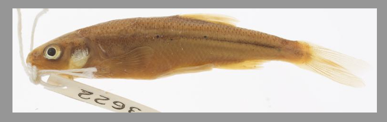
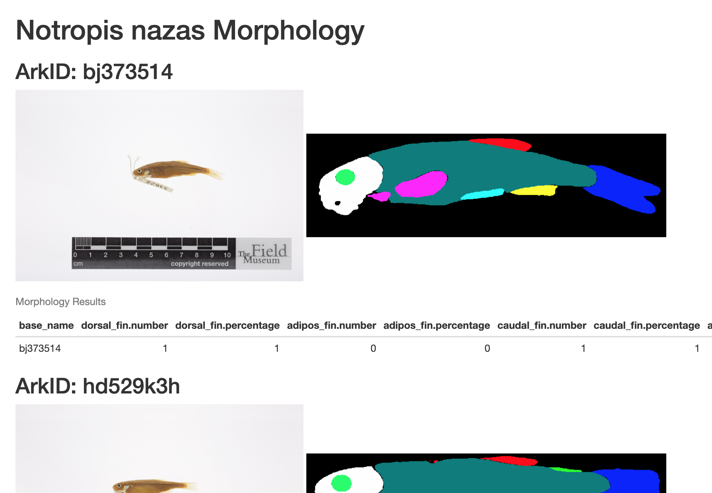

## Use directories to organize files
When working with Snakemake it is important to have a plan for how to organize your files.
One good practice that Snakemake supports is to store each rule's output files in subdirectories.
This makes it easy to tell where the input files used in a rule came from. This helps 
determining which rule that created a file.

## Input CSV
The input CSV (`multimedia.csv`) was downloaded from https://bgnn.tulane.edu/.

When viewed within RStudio the data looks like this:
{alt='Table of fish images'}


## Step 1: Reduce CSV size
Reduce the total size of the input CSV using a simple command line utility.
This demonstrates creating a simple rule that receives input and output command line arguments.
The result of this step will be saved at `reduce/multimedia.csv`.

## Step 2: Filter for our target species
Next we run an R script to filtering our CSV for `Notropis nazas` species.

When viewed within RStudio the data looks like this:
{alt='Table of filtered fish images'}
The result of this step will be saved at `filter/multimedia.csv`.

## Step 3: Download images
Since we will be downloading many images from multiple locations  having a plan for how to name these files is important.

The [Tulane multimedia.csv documentation](https://bgnn.tulane.edu/) describes the `arkID` column as:

> Multimedia unique identifier number

__arkID__ seems like a good identifier to use in our image filenames.

For the multimedia row with arkID `dd216t3d` we will save the downloaded image as:
```
images/dd216t3d.jpg
```

Example image:
{alt='Image of fish'}


## Step 4: Detect fish in each image
Next we use a tool to determine the location of the fish in each image.
We will reuse another workflow and use it's filenaming schema for the next 3 steps.

## Step 5: Crop each fish image
We then crop each image with the bounding box from the object detection step.
{alt='Cropped image of fish'}

## Step 6: Segment each fish image
Next we use a tool to segment each cropped image.
{alt='Segmented image of fish'}

## Step 8. Create summary report
Finally we create a report using another R script that summarizes the results of our processing.

The HTML report will look something like this:
{alt='Screenshot of html report'}
We will save the output as `summary/report.html`.

