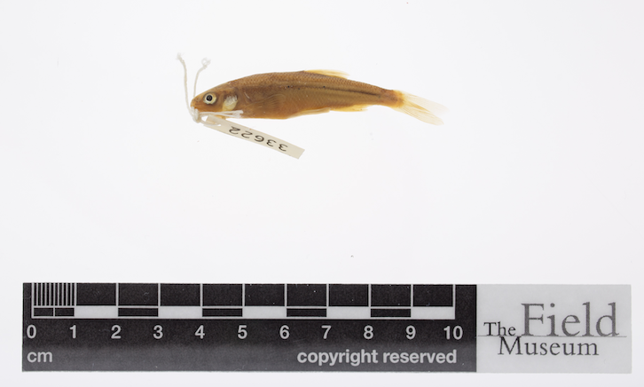
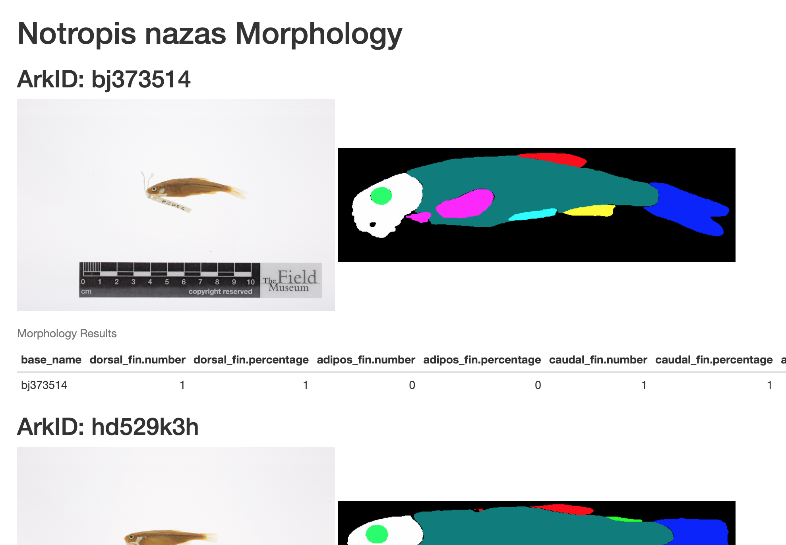

## Workflow Steps

### Input CSV
The input CSV (`multimedia.csv`) was downloaded from https://bgnn.tulane.edu/.

When viewed within RStudio the data looks like this:

### Step 1: Reduce the size of our input CSV
Reduce the total size of the input CSV using a simple command line utility.
This demonstrates creating a simple rule that receives input and output command line arguments.

### Step 2: Filter CSV for our target species
Next we run an R script to filtering our CSV for `Notropis nazas` species.

When viewed within RStudio the data looks like this:

### Step 3: Download images
Next download each image from the filtered CSV.

### Step 4: Detect fish in each image
Next we use a tool to determine the location of the fish in each image.

### Step 5: Crop each fish image
We then crop each image with the bounding box from the object detection step.

### Step 6: Segment cropped images
Next we use a tool to segment each cropped image.

### Step 7. determine presence absence morphology 
Next we run a tool that looks at colors in the segmented images to determine a presence absence matrix.

### Step 8. final analysis
Finally we create a report using another R script that summarizes the results of our processing.

The HTML report will look something like this:

