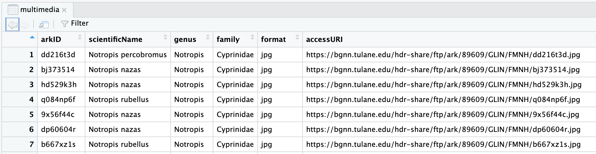

## Use directories to organize files
When working with Snakemake it is important to have a plan for how to organize your files.
One good practice that Snakemake supports is to store each rule's output files in subdirectories.
This makes it easy to tell where the input files used in a rule came from. This helps 
determining which rule that created a file.

For our first step where we reduce the input file `multimedia.csv` we will save output filename as 
`reduce/multimedia.csv`.

## Name image files based on a unique ID
Additionally since we will be downloading many images from multiple locations 
having a plan for how to name these files is important.

Looking at our main input file (multimedia.csv) we can see details about the files:


The [Tulane multimedia.csv documentation](https://bgnn.tulane.edu/) describes the `arkID` column as:

> Multimedia unique identifier number

__arkID__ seems like a good identifier to use in our image filenames.

For the multimedia row with arkID `dd216t3d` we will save the downloaded image as:
```
images/dd216t3d.jpg
```

For subsequent rules that process images the `arkID` value will be re-used.
For example the object detection rule would create an output file named:
```
object_detection/metadata_dd216t3d.json
```
