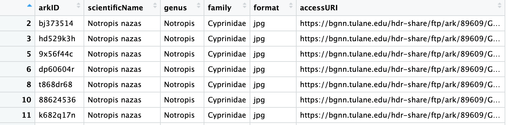
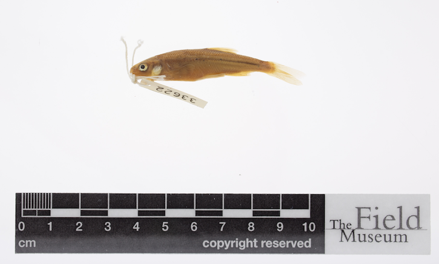
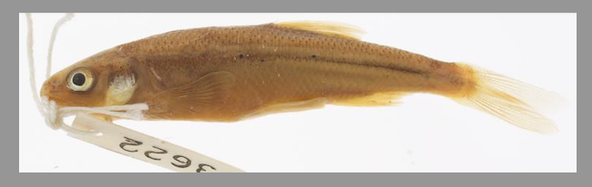
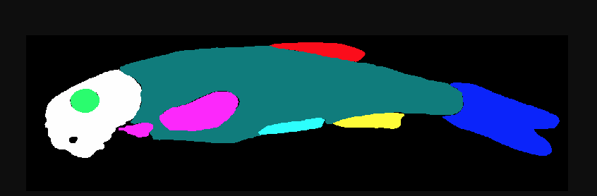
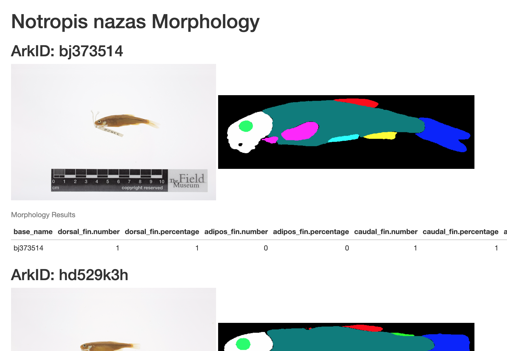

:::::::::::::::::::::::::::::::::::::: questions 

- TODO

::::::::::::::::::::::::::::::::::::::::::::::::

::::::::::::::::::::::::::::::::::::: objectives

- TODO

::::::::::::::::::::::::::::::::::::::::::::::::

## Introduction

Explain why one would use a workflow language when developing a workflow
Show high level view of the workflow we going building
	Show challenges when using bash or another scripting language
		not re-running the entire process every time
		scaling
Explain how Snakemake works to addresses these challenges
snakemake rule: input, output, shell
can use python in Snakefile

## Workflow Steps

### Input CSV

### Step 1: Reduce the size of our input CSV
### Step 2: Filter CSV for our target species

### Step 3: Download images

### Step 4: Detect fish in each image

### Step 5: Crop each fish image

### Step 6: Segment cropped images

### Step 7. determine presence absence morphology 
### Step 8. final analysis

