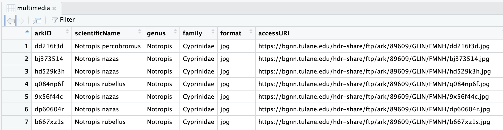

## Input filename

## Initial Rule filenames
```
reduce/multimedia.csv
```

```
filter/multimedia.csv
```

## Image filenaming
We need to determine a good naming convention for downloading images.

Here is a screenshot of our main input file:


The [Tulane multimedia.csv documentation](https://bgnn.tulane.edu/) describes the `arkID` column as:

> Multimedia unique identifier number

`arkID` seems like a good identifier to use in our image filenames.
So for the multimedia row with an arkID of `dd216t3d` we will save the image as:
```
images/dd216t3d.jpg
```

## Image processing filenaming


