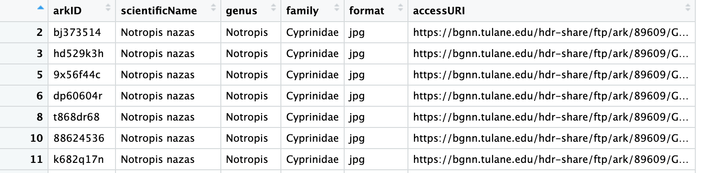
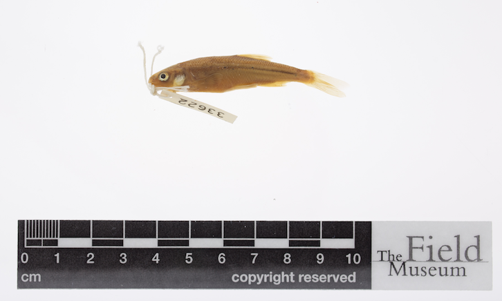
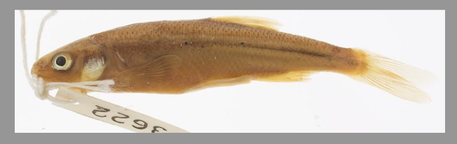
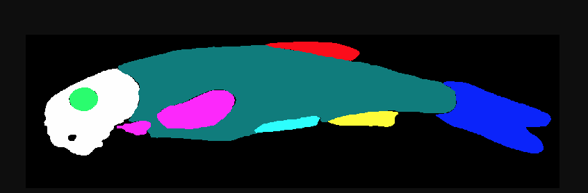
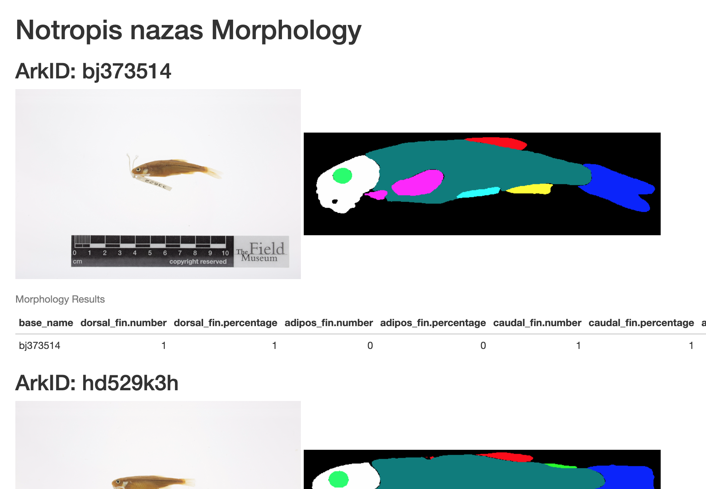

## Goals
- Understanding the problem that workflow languages are trying to solve
  - Many players in this field
  - Understand the strengths of Snakemake
- Create and run a Snakemake Workflow
  - Runs R scripts for filtering and final analysis
  - Runs Machine Learning Components
  - Process many files at the same time

## Why use a Workflow Language?
### Workflow Challenges
- Reproducibility
- Not re-running the entire workflow on every change
- Dependency management
- Efficiently scaling the workflow using a HPC Cluster

### Snakemake
- Breaks up workflow into rules and runs only the parts necessary
- Provides support for specifying containers for each rule
- Provides support for many HPC Clusters including SLURM

## What is a Snakemake Rule?

A Snakemake Rule specifies

- input files
- output files
- shell command that reads the input file and writes the output files


Example rule
```
rule count_words:
    input: 'books/isles.txt'
    output: 'isles.dat'
    shell: 'python wordcount.py books/isles.txt isles.dat'
```
_This rule was copied from the [carpentries incubator hpc-workflows lesson](https://carpentries-incubator.github.io/hpc-workflows/02-snakefiles/index.html)._

## Workflow Steps

### Input CSV
The input CSV (`multimedia.csv`) was downloaded from https://bgnn.tulane.edu/.

When viewed within RStudio the data looks like this:


### Step 1: Reduce the size of our input CSV
Reduce the total size of the input CSV using a simple command line utility.
This demonstrates creating a simple rule that receives input and output command line arguments.

### Step 2: Filter CSV for our target species
Next we run an R script to filtering our CSV for `Notropis nazas` species.

When viewed within RStudio the data looks like this:


### Step 3: Download images
Next download each image from the filtered CSV.


### Step 4: Detect fish in each image
Next we use a tool to determine the location of the fish in each image.

### Step 5: Crop each fish image
We then crop each image with the bounding box from the object detection step.


### Step 6: Segment cropped images
Next we use a tool to segment each cropped image.


### Step 7. determine presence absence morphology 
Next we run a tool that looks at colors in the segmented images to determine a presence absence matrix.

### Step 8. final analysis
Finally we create a report using another R script that summarizes the results of our processing.

The HTML report will look something like this:



